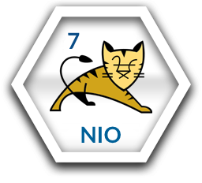

# Welcome to Tomcat7 NIO Connector Clickstart

This is a "ClickStart" that gets you going with a Tomcat 7 with HTTP NIO connector "seed" project starting point. You can launch it here:

<a href="https://grandcentral.cloudbees.com/?CB_clickstart=https://raw.github.com/CloudBees-community/tomcat7-nio-connector-clickstart/master/clickstart.json"></a>

This will setup a continuous deployment pipeline - a CloudBees Git repository, a Jenkins build compiling and running the test suite (on each commit).
Should the build succeed, this seed app is deployed on a Tomcat 7 container.


# Tomcat 7 NIO Connector

Extract from Tomcat7 startup logs showing that the application uses the NIO Connector

```
Jul 30, 2013 9:54:41 PM org.apache.coyote.AbstractProtocol init
INFO: Initializing ProtocolHandler ["http-nio-8751"]
Jul 30, 2013 9:54:42 PM org.apache.tomcat.util.net.NioSelectorPool getSharedSelector
INFO: Using a shared selector for servlet write/read
...
Jul 30, 2013 9:54:43 PM org.apache.coyote.AbstractProtocol start
INFO: Starting ProtocolHandler ["http-nio-8751"]
...
```





